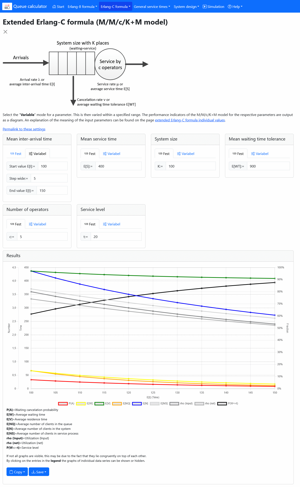

# Warteschlangenrechner / Queue calculator

Queue calculator is a web service for calculating the characteristics of different queueing models.

## Usage

To use queue calculator just go to

**[a-herzog.github.io/QueueCalc](https://a-herzog.github.io/QueueCalc)**

## Download

You can also download queue calculator as an offline usable application:

* **[QueueCalc.exe](https://github.com/A-Herzog/QueueCalc/releases/latest/download/QueueCalc.exe)** (for Windows)
* **[QueueCalc_Linux_MacOS.zip](https://github.com/A-Herzog/QueueCalc/releases/latest/download/QueueCalc_Linux_MacOS.zip)** (for Linux and MacOS)

## License

Warteschlangenrechner / Queue calculator is licensed under the [Apache License, Version 2.0](https://www.apache.org/licenses/LICENSE-2.0).

This product bundles some components licensed under different open source licenses, see:

- [**Bootstrap**](https://getbootstrap.com/): [MIT license](https://opensource.org/license/mit/)
- [**Bootstrap icons**](https://icons.getbootstrap.com): [MIT license](https://opensource.org/license/mit/)
- [**Chart.js**](https://www.chartjs.org): [MIT license](https://opensource.org/license/mit/)

For building a desktop app from the Javascript code [**Neutralinojs**](https://neutralino.js.org/) under the
[MIT license](https://opensource.org/license/mit/) is used.

## Contact

[Alexander Herzog](https://github.com/A-Herzog)